# End-To-End Workflow

AirEye uses a neutral flow: capture a document image -> optionally run a prompt-configured import workflow -> return an export row.

Backend routes require `x-api-key: Gnn12345!` for `/health`, `/api/v1/*`, and `/openapi.yaml`. `/docs` is public and embeds the OpenAPI content server-side. `OPTIONS /openapi.yaml` remains unauthenticated for CORS preflight and allows the `x-api-key` header.

1. Receiver mobile calls `POST /api/v1/send-notification`.
2. Backend sends a silent FCM topic data message to sender devices: `kind: capture_request`, `notificationType: silent`, `role: sender`.
3. Sender camera listens for foreground `capture_request` messages, takes a photo, then calls `POST /api/v1/import` with that image.
4. Backend stores the image in S3/MinIO, writes a pending export row, broadcasts `export_refresh`, enqueues a Redis/BullMQ job, and returns `202` JSON: `{ "status": "queued", "jobId": "...", "uploadId": "upl_..." }`.
5. The queued job references stored image metadata (`uploadId`, `imageUrl`, `bucket`, `objectKey`), not image bytes.
6. The worker processes import and regenerate jobs FIFO with concurrency one.
7. For imports, the worker reads `{development|production}/auto_analyse` from Firebase Realtime Database. Missing `auto_analyse` defaults to `true`.
8. If `auto_analyse` is `false`, the pending image-only row is terminal and the worker skips provider lookup, Langfuse tool reasoning, and LiteLLM workflow execution.
9. If `auto_analyse` is `true`, the worker fetches the Langfuse tool-reasoning prompt. The resulting plan contains ordered workflow steps; each workflow step references a Langfuse prompt and selects either a vision step or reasoning step.
10. Backend updates the export row with `extractedText` and `finalText`. The first step output is `extractedText`; the final step output is `finalText`.
11. Worker failures persist `errorMessage` on the export row.
12. Receiver mobile maps `export_refresh` to its existing export endpoint function and reads canonical list data from `GET /api/v1/export`.

## Routes

`GET /api/v1/health`, `POST /api/v1/send-notification`, `POST /api/v1/import`, `POST /api/v1/regenerate`, `GET /api/v1/export`, `GET /api/v1/provider`, `PUT /api/v1/provider`, `PUT /api/v1/auto-analyse`, `GET /openapi.yaml`, `GET /docs` (Scalar).

## Flow

```mermaid
flowchart TD
    Start([POST /api/v1/import]) --> S3[Upload image to S3 / MinIO]
    S3 --> RTDB1[Write pending row under uploads/&#123;id&#125;]
    RTDB1 --> FCM1[broadcastExportRefresh - 1st]
    FCM1 --> Queue[BullMQ Redis FIFO queue]
    Queue --> Accepted[/HTTP 202 queued JSON/]
    Queue --> Worker[Worker concurrency 1]
    Worker --> AutoAnalyseFlag[Read RTDB &#123;namespace&#125;/auto_analyse]
    AutoAnalyseFlag --> AutoAnalyseEnabled{auto_analyse enabled?}
    AutoAnalyseEnabled -- false --> ImageOnly[Keep image-only row terminal]
    AutoAnalyseEnabled -- true --> Plan[Langfuse tool-reasoning prompt]
    Plan --> StepLoop{Workflow step}
    StepLoop --> StepModel{Step model}
    StepModel -- vision step --> Vision[LiteLLM provider-image]
    StepModel -- reasoning step --> Reasoning[LiteLLM provider-reasoning]
    Vision --> Output[Collect step output]
    Reasoning --> Output
    Output --> More{More steps?}
    More -- yes --> StepLoop
    More -- no --> RTDB2[Update uploads/&#123;id&#125; with normalized output]
    RTDB2 --> FCM2[broadcastExportRefresh - 2nd]
    FCM2 --> Done([Receiver refreshes export])

    ImageOnly --> Done
    Plan -- error --> ErrorPath[Persist errorMessage]
    Vision -- error --> ErrorPath
    Reasoning -- error --> ErrorPath
    ErrorPath --> FCM3[broadcastExportRefresh - failure]
    FCM3 --> Done

    classDef llm fill:#fce8e6,stroke:#cc2c2c,color:#3b0a0a
    classDef http fill:#e6f4ea,stroke:#188038,color:#0c2c14
    classDef store fill:#e8f0fe,stroke:#1967d2,color:#0c1f3b
    classDef err fill:#fff3e0,stroke:#e65100,color:#3b1e00

    class Plan,Vision,Reasoning llm
    class Accepted http
    class AutoAnalyseFlag,S3,RTDB1,RTDB2,FCM1,FCM2,FCM3 store
    class ErrorPath err
```

## Persisted Shape

Under `uploads/{id}` the server stores JSON with at least `createdAt` and `updatedAt`. After storage succeeds the pending row includes `imageUrl`, `bucket`, and `objectKey`. When `auto_analyse` is `false`, that image-only row is terminal and does not include `extractedText` or `finalText`. When `auto_analyse` is `true`, success adds `extractedText` and `finalText`; failure adds `errorMessage`. Exact keys are defined by `AirEyeUpload` in `backend/src/api/v1/model/import.model.ts`.

## Notes

- `POST /api/v1/import` and `POST /api/v1/regenerate` share one Redis-backed BullMQ FIFO queue. The HTTP request returns `202` after queue submission.
- `POST /api/v1/import` waits for S3/MinIO storage, pending row creation, best-effort initial FCM refresh, and queue submission. Workflow processing happens after the response.
- A pending row is written under `uploads/{id}` after image storage succeeds, before workflow execution starts.
- `PUT /api/v1/auto-analyse` accepts `{ "auto_analyse": boolean }` and stores the bool flag at `{development|production}/auto_analyse`.
- `auto_analyse` only gates `POST /api/v1/import`; `POST /api/v1/regenerate` does not read any flag and always reruns the workflow.
- If reading the `auto_analyse` flag fails in the worker, the upload row is updated with `errorMessage`.
- `GET /api/v1/export` is the source of truth for export row data; FCM is only a refresh hint.
- Topic resolution is `AIREYE_FCM_TOPIC`, then the AirEye default `aireye_new_result`.
- `docs/workflow copy.md` is intentionally untouched.

---

**Updated:** 2026-06-04
**Applies to:** AirEye backend + Flutter capture/import flow (`backend/src/`, `mobile/packages/sender`, `mobile/packages/receiver`)
**Doc version:** 11
