# End-To-End Workflow

AirEye uses a neutral flow: capture a document image -> optionally run a prompt-configured workflow -> return an export row.

Backend routes require `x-api-key: Gnn12345!` for `/health`, `/api/v1/*`, and `/openapi.yaml`. `/docs` is public and embeds the OpenAPI content server-side. `OPTIONS /openapi.yaml` remains unauthenticated for CORS preflight and allows the `x-api-key` header.

1. Receiver mobile calls `POST /api/v1/send-notification`.
2. Backend sends a silent FCM topic data message to sender devices: `kind: capture_request`, `notificationType: silent`, `role: sender`.
3. Sender camera listens for foreground `capture_request` messages, takes a photo, then calls `POST /api/v1/import` with that image.
4. Backend reads `{development|production}/ai` from Firebase Realtime Database. Missing `ai` defaults to `true`.
5. Backend stores the image, writes a pending export row, and streams `text/event-stream`.
6. If `ai` is `false`, the backend broadcasts one export refresh, emits the image-only terminal row, and skips provider lookup, Langfuse tool reasoning, and LiteLLM workflow execution.
7. If `ai` is `true`, the backend fetches the Langfuse tool-reasoning prompt. The resulting plan contains ordered workflow steps; each workflow step references a Langfuse prompt and selects either a vision step or reasoning step.
8. For every workflow step, the backend emits a `running_step` SSE event, runs the step through LiteLLM, then emits the step output.
9. Backend updates the export row with `extractedText` and `finalText`. The first step output is `extractedText`; the final step output is `finalText`.
10. Receiver mobile maps `export_refresh` to its existing export endpoint function and reads canonical list data from `GET /api/v1/export`.

## Routes

`GET /api/v1/health`, `POST /api/v1/send-notification`, `POST /api/v1/import`, `POST /api/v1/regenerate`, `GET /api/v1/export`, `GET /api/v1/provider`, `PUT /api/v1/provider`, `PUT /api/v1/ai`, `GET /openapi.yaml`, `GET /docs` (Scalar).

## Flow

```mermaid
flowchart TD
    Start([POST /api/v1/import]) --> AiFlag[Read RTDB &#123;namespace&#125;/ai]
    AiFlag --> S3[Upload image to S3 / MinIO]
    S3 --> RTDB1[Write pending row under uploads/&#123;id&#125;]
    RTDB1 --> FCM1[broadcastExportRefresh - 1st]
    FCM1 --> AiEnabled{ai enabled?}
    AiEnabled -- false --> EmitImageOnly[/SSE: image-only final export row/]
    EmitImageOnly --> Done([HTTP stream closes])
    AiEnabled -- true --> Plan[Langfuse tool-reasoning prompt]
    Plan --> StepLoop{Workflow step}
    StepLoop --> Running[/SSE: status = running_step/]
    Running --> StepModel{Step model}
    StepModel -- vision step --> Vision[LiteLLM provider-image]
    StepModel -- reasoning step --> Reasoning[LiteLLM provider-reasoning]
    Vision --> Output[/SSE: data.stepIndex + output/]
    Reasoning --> Output
    Output --> More{More steps?}
    More -- yes --> StepLoop
    More -- no --> RTDB2[Update uploads/&#123;id&#125; with normalized output]
    RTDB2 --> FCM2[broadcastExportRefresh - 2nd]
    FCM2 --> EmitRow[/SSE: final export row/]
    EmitRow --> Done

    AiFlag -- error --> PreflightError[Fail before image upload]
    PreflightError --> Done
    Plan -- error --> ErrorPath[Persist errorMessage]
    Vision -- error --> ErrorPath
    Reasoning -- error --> ErrorPath
    ErrorPath --> EmitError[/SSE: error code + message/]
    EmitError --> Done

    classDef llm fill:#fce8e6,stroke:#cc2c2c,color:#3b0a0a
    classDef sse fill:#e6f4ea,stroke:#188038,color:#0c2c14
    classDef store fill:#e8f0fe,stroke:#1967d2,color:#0c1f3b
    classDef err fill:#fff3e0,stroke:#e65100,color:#3b1e00

    class Plan,Vision,Reasoning llm
    class Running,Output,EmitRow,EmitImageOnly,EmitError sse
    class AiFlag,S3,RTDB1,RTDB2,FCM1,FCM2 store
    class ErrorPath,PreflightError err
```

## Persisted Shape

Under `uploads/{id}` the server stores JSON with at least `createdAt` and `updatedAt`. After storage succeeds the pending row includes `imageUrl`, `bucket`, and `objectKey`. When `ai` is `false`, that image-only row is terminal and does not include `extractedText` or `finalText`. When `ai` is `true`, success adds `extractedText` and `finalText`; failure adds `errorMessage`. Exact keys are defined by `AirEyeUpload` in `backend/src/api/v1/model/import.model.ts`.

## Notes

- `POST /api/v1/import` keeps the HTTP connection open until S3/MinIO, optional prompt-configured workflow, Realtime Database update, and FCM refresh handling finish.
- A pending row is written under `uploads/{id}` after image storage succeeds, before workflow execution starts.
- `PUT /api/v1/ai` accepts `{ "ai": boolean }` and stores the flag at `{development|production}/ai`.
- If reading the AI flag fails, import fails before image upload starts.
- `GET /api/v1/export` is the source of truth for export row data; FCM is only a refresh hint.
- Topic resolution is `AIREYE_FCM_TOPIC`, then the AirEye default `aireye_new_result`.
- `docs/workflow copy.md` is intentionally untouched.

---

**Updated:** 2026-05-24
**Applies to:** AirEye backend + Flutter capture/import flow (`backend/src/`, `mobile/packages/sender`, `mobile/packages/receiver`)
**Doc version:** 8
